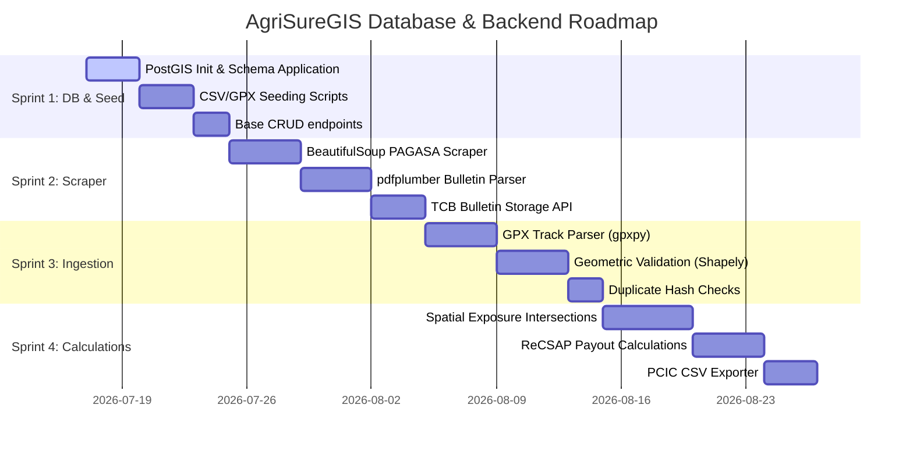

# AgriSureGIS — Backend & Database Development Workflow

This document outlines the step-by-step development workflow, database schema structure, and sprint execution plan for the **AgriSureGIS** database and backend API.

---

## 1. System Architecture Overview

The backend is built as a localized geoprocessing service designed to execute on PCIC Region X's local area network (LAN) to ensure data privacy.

```mermaid
graph TD
    subgraph Client Layer
        WebUI[React Frontend / Leaflet Map]
    end

    subgraph Service Layer (FastAPI Backend)
        API[FastAPI Router]
        Scraper[PAGASA Web Scraper]
        Parser[GPX & CSV ETL Pipeline]
        GeoEngine[GeoPandas / Shapely Spatial Engine]
    end

    subgraph Database Layer (PostgreSQL 15+ / PostGIS 3+)
        DB[(PostgreSQL Database)]
        GIS[(PostGIS Spatial Extension)]
    end

    WebUI -->|REST APIs| API
    Scraper -->|TCB PDFs| GeoEngine
    Parser -->|Polygons & Profiles| DB
    GeoEngine -->|Exposure & Payouts| DB
    DB <---> GIS
```

---

## 2. Relational Database Schema Design
All tables are prefixed with `tbl_` and mapped using SQLAlchemy / GeoAlchemy2. Fabio (DB Admin) is the custodian of these schemas.

### Core Tables
1. **`tbl_system_users`**: Stores admin and GIS specialist user credentials and details.
2. **`tbl_farmers_profile`**: RSBSA-registered farmer profiles.
3. **`tbl_admin_boundaries`**: Geographical region codes and boundary details linked to the PSGC.
4. **`tbl_farms`**: Farmland details including spatial attributes (`location_geom` as `Geometry(MultiPolygon, 4326)`).
5. **`tbl_insurance_records`**: Active insurance policies linking farmers, crops, and coverages.
6. **`tbl_recsap_matrix`**: The static reference lookup containing crop growth stages, TCWS signals, yield loss rates, and indemnity factors.
7. **`tbl_typhoons`**: Active and archived storms inside the Philippine Area of Responsibility (PAR).
8. **`tbl_tropical_cyclone_bulletins`**: Multi-versioned bulletin logs parsed from PAGASA, storing the eye center (`center_geom` as `Geometry(Point, 4326)`).
9. **`tbl_tcb_signals`**: Regions/provinces/municipalities placed under specific TCWS signals.
10. **`tbl_area_exposure_summary`**: Calculated exposure duration (hours) for each administrative boundary.
11. **`tbl_risk_assessment`**: The final output records storing the calculated payouts.


---

## 3. Sprint Roadmap



### Sprint 1: Database Setup & Seed Ingestion (Current)
* **Objective:** Establish the localized database, apply schemas, and seed baseline profiles.
* **Step-by-Step Backend Tasks:**
  1. **Provision DB:** Enable PostGIS extension: `CREATE EXTENSION IF NOT EXISTS postgis;`
  2. **Apply Schema:** Apply [init_schema.sql](file:///home/fabio/Documents/AgriSureGIS/backend/init_schema.sql) containing constraints, foreign keys, and spatial indices (`GIST` index on `tbl_farms.location_geom`).
  3. **Write DB Models:** Map SQLAlchemy models in `app/models/models.py`.
  4. **Seeding Script:** Complete `seed_database.py` to ingest legacy `pabs_results.csv` and normalize records into `tbl_farmers_profile` and `tbl_insurance_record`.
  5. **Base API:** Expose CRUD routes for farmers and policies.

### Sprint 2: PAGASA bulletin Parser & Scraper
* **Objective:** Automate the acquisition and storage of typhoon warning bulletins.
* **Step-by-Step Backend Tasks:**
  1. **Web Scraping:** Build an asynchronous task using `httpx` and `BeautifulSoup4` to crawl the PAGASA active bulletins index page.
  2. **PDF Downloader:** Download TCB bulletin PDFs programmatically and store them locally (archived to prevent loss when PAGASA purges files).
  3. **Data Extraction:** Use `pdfplumber` to extract:
     - Bulletin number, issue date/time, and expiry date.
     - Storm coordinates (center latitude/longitude).
     - Affected municipal list sorted by Tropical Cyclone Wind Signal (TCWS 1 to 5).
  4. **Bulletin API:** Endpoint `/api/bulletins/parse` to trigger scraping and return parsed JSON.

### Sprint 3: GPX Parser & Spatial Boundary Processing
* **Objective:** Ingest farm boundaries and check coordinate topologies.
* **Step-by-Step Backend Tasks:**
  1. **GPX Ingestion:** Endpoint `/api/upload/gpx` accepting `.gpx` files.
  2. **GPX Parsing:** Use `gpxpy` to parse trackpoints (Lat, Lon, Elevation) from GPX files.
  3. **Geometry Construction:** Convert coordinate streams into Shapely `Polygon` structures.
  4. **Coordinate Transformation:** Standardize all coordinates to WGS 84 (SRID 4326) using `pyproj` and `GeoPandas`.
  5. **Boundary Duplicate Check:** Hash the coordinate stream cryptographically (SHA-256) to ensure no farmer uploads identical geometries.
  6. **Spatial Insertion:** Write polygons into `tbl_farms.location_geom` via GeoAlchemy2.

### Sprint 4: Spatial Overlay & Parametric Calculations
* **Objective:** Perform geoprocessing to determine risk exposure and payout amounts.
* **Step-by-Step Backend Tasks:**
  1. **Typhoon Path Overlay:** Intersect the storm trajectory buffer with farm coordinates in PostGIS.
  2. **Calculate Exposure Hours:** Sum the duration (in hours) that a municipal boundary was exposed to a specific TCWS signal:
     $$\text{Exposure Duration} = \sum (\text{expires\_at} - \text{issued\_at})$$
  3. **Check Payout Eligibility:**
     - Must belong to wind signal $\ge 2$.
     - Exposure duration must be $\ge 6$ hours.
     - Verify crop growth stage is in Booting, Flowering, or Maturity.
  4. **Run Payout Engine:** Apply the formula:
     $$I = \left(\frac{AC}{1000}\right) \times IF \times \text{Area}$$
     - Fetch $IF$ (Indemnity Factor) from `tbl_recsap_matrix` using Yield Loss intersection.
  5. **PCIC CSV Export:** Package results into a final CSV report appended to original row layouts for the PCIC Finance Division.
